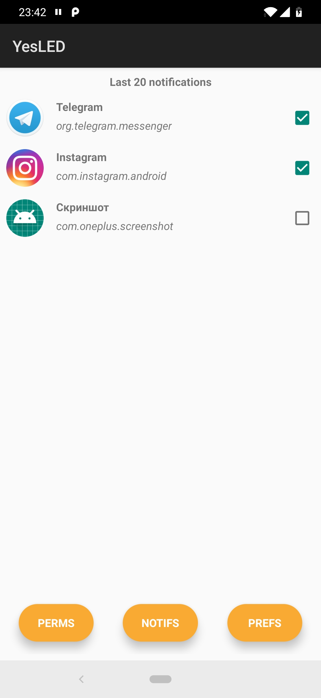
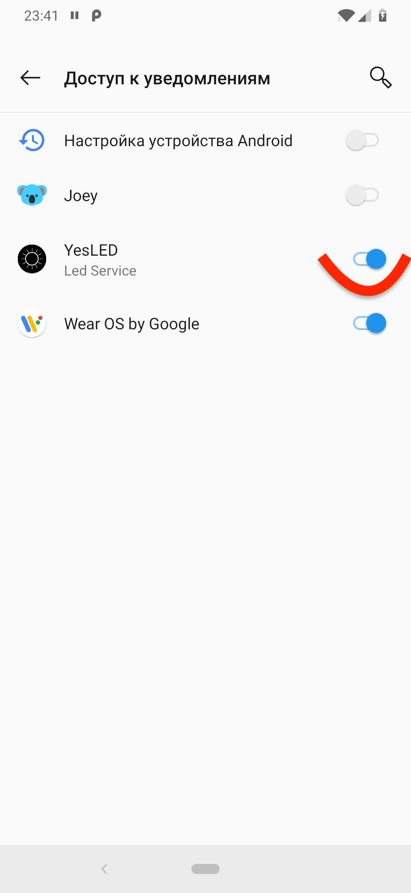
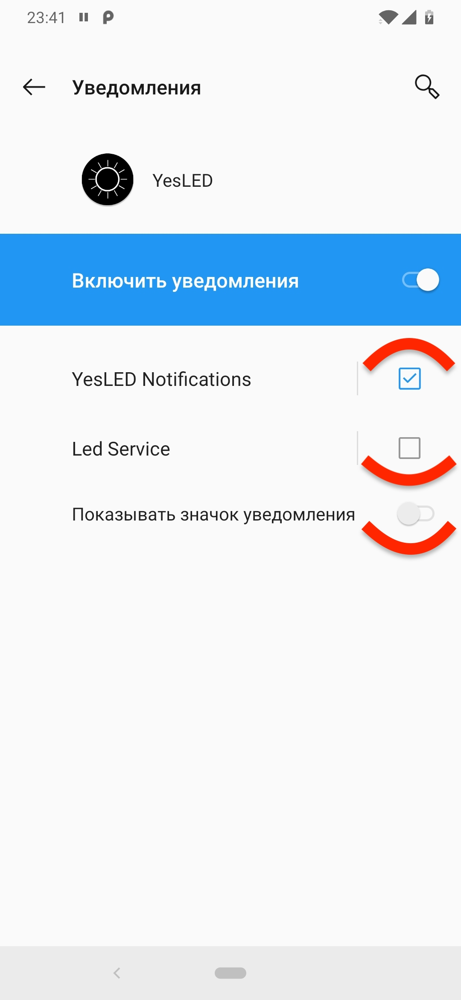
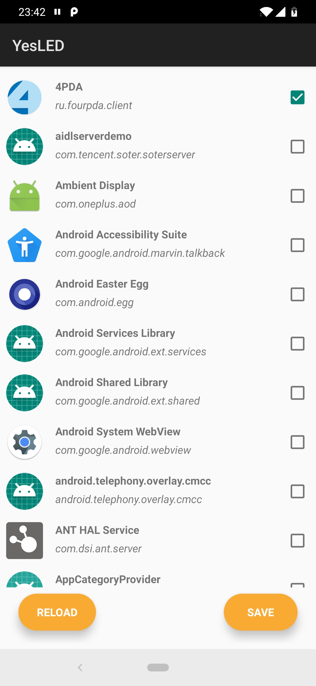

# YesLED
AOD notifications for OnePlus 6T

## Setup howto:
Open app

Goto PERMS and enable YesLED notification access

Return to main and goto NOTIFS. Disable Led Service channel, enable YesLED Notifications, hide notification mark.

Return to main and goto PREFS. Select apps you wish then press SAVE.

BTW: You can manage app selection right from the list of last 20 notifications on the mainn screen.
